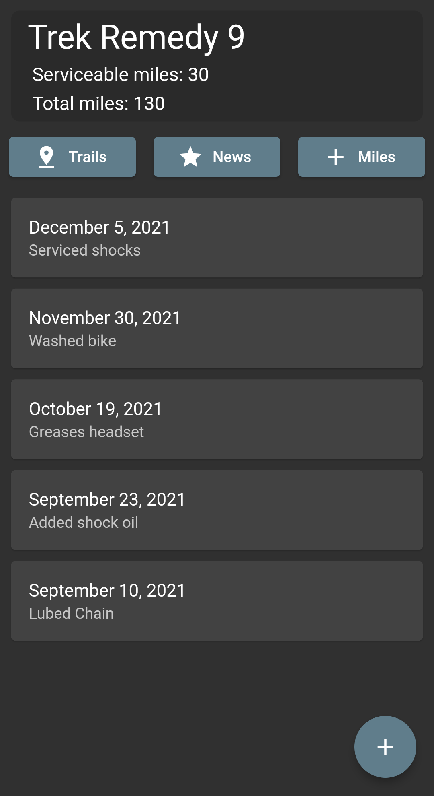
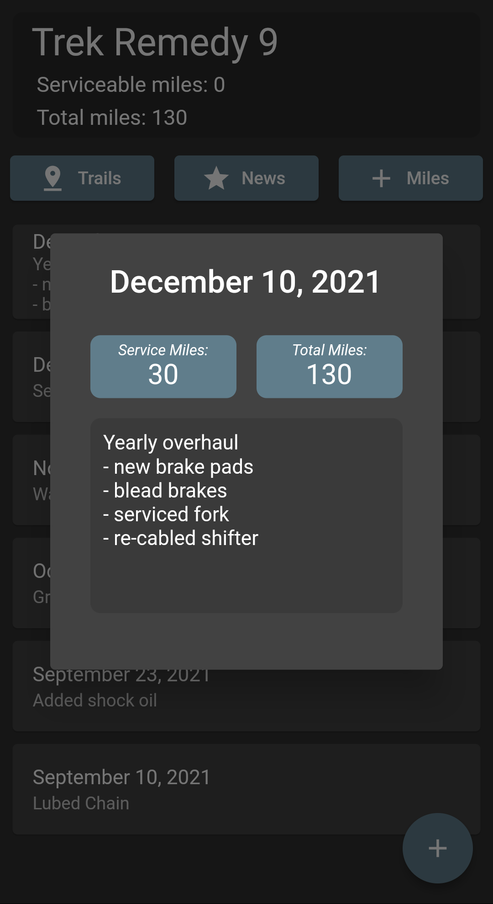
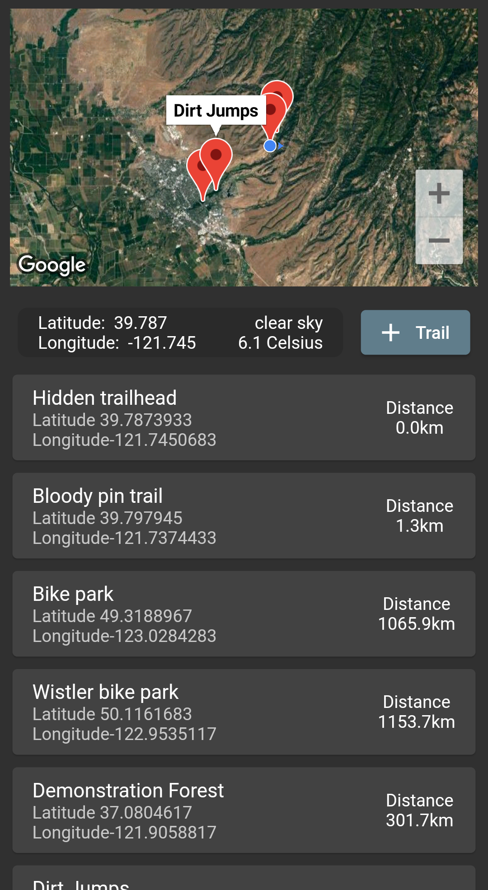
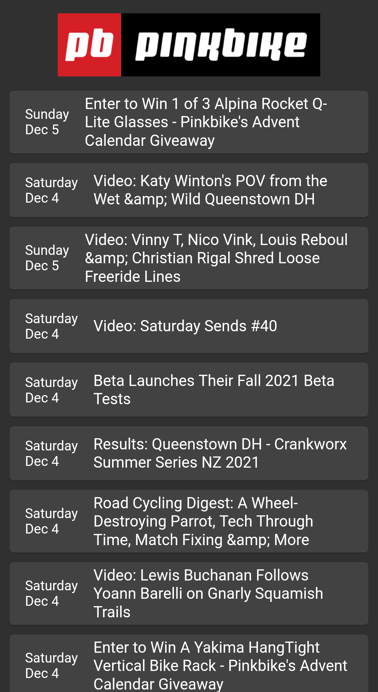

# Wrenched - A cycling companion app

### Oliver Lynch Capstone 
#### CSU Chico, Fall 2021

Wrenched was born out of a necessity for something better. Before its creation, maintenance records where things only bike shop mechanics would keep. Because of this, many cyclists have a hard time remembering just how long it has been since they did a full service, chain replacement or even the last time they washed and lubed their bike. Other cycling apps try to help solve this by letting users know how many total miles are on their bike. This is great information to have but it does not paint a full picture, leading cyclists to get creative in order to further solve the issue. The most common thing to do is have a little notebook and write down all the work that you have done. This was the ideological foundation that wrenched was built upon. Wrenched is a cycling companion app that helps riders better take care of their bicycle though the use of data rich service logs. 

In the app there are 3 main sections, the service log, the trail head saver and the news feed. The service log is the landing page and is the focus of the app. On this page users can easily add milage or record a service to their bike, view past services and navigate to other sections of the app. The trail section of the app allows users to easily keep track of their favorite biking locations as well as easily navigate to them. It features a google map pinboard that visually shows the location of all the trails while also allowing users to explore nearby areas using its satellite camera. Finally, the app provides a Pinkbike news feed so users can keep up to date with all that is happening in the wonderful world of cycling.

This app is written in flutter for both android and iOS users. It relies on a custom designed back end for data storage using JSON files as well as the Google map API. It also incorporates a suite of other libraries and plugins for a lot of the available features. 

## Features

#### Maintenance page
 - Log milage
 - Log service
 - View past services 
 
#### Trail page
 - Google map pinboard
 - Quadridentate based location
 - List of saved Trails
 - Quick navigation 

#### Pinkbike news feed

## Images

    
    

